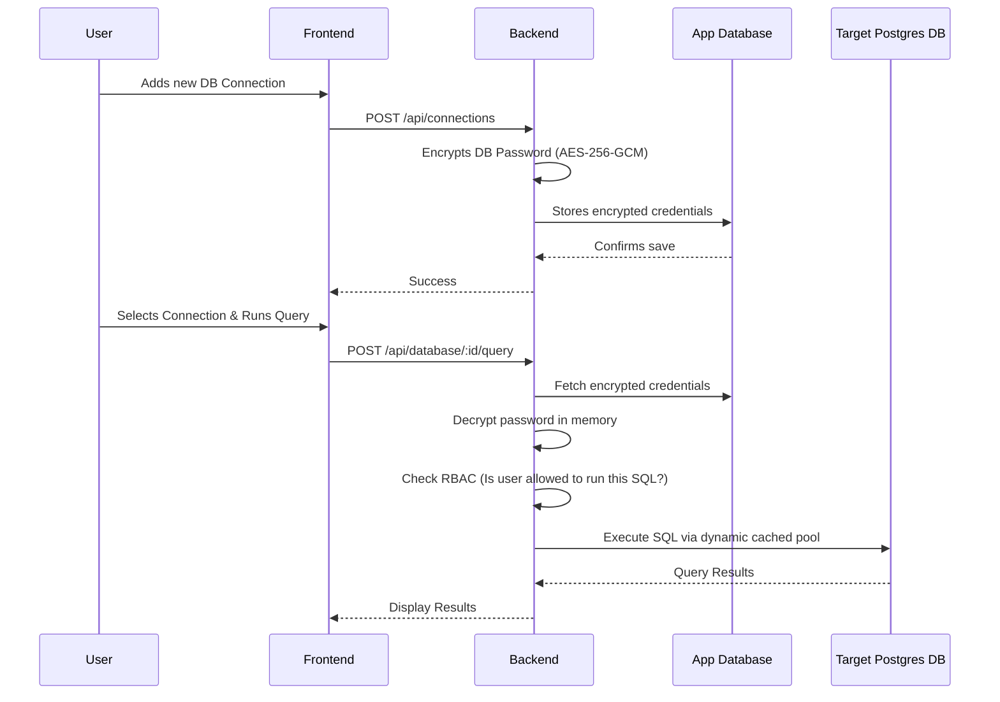

```python
content = """# 🗄️ DB Browser

A secure, web-based PostgreSQL database browser and query execution tool. 

DB Browser allows users to securely connect to their own PostgreSQL databases (such as AWS RDS, Supabase, or local instances), browse schemas, view table relationships, and execute SQL queries directly from the browser—all without installing desktop client software.

## ✨ Key Features

* **🔒 Enterprise-Grade Security:** Database passwords are encrypted at rest using `AES-256-GCM` and only decrypted in-memory during active sessions.
* **🎭 Role-Based Access Control (RBAC):** Built-in query enforcer that restricts execution based on user roles (Admin, Editor, Viewer). Viewers are restricted to `SELECT`/`EXPLAIN`, while Editors can perform `INSERT`/`UPDATE`/`DELETE`.
* **🔄 Dynamic Connection Pooling:** Intelligently caches database connection pools per unique connection ID, preventing memory leaks and optimizing connection limits.
* **📊 Visual Schema Browsing:** Easily browse databases, schemas, tables, columns, and foreign key relationships.
* **⚡ Live SQL Execution:** Run custom SQL queries with built-in 60-second timeouts to prevent hanging transactions.
* **📥 CSV Export:** One-click export of query results directly to CSV.
* **📱 Frictionless Authentication:** Device-based identification (`X-Device-Id`) means no complex signup flows just to quickly check a database.

---

## 🏗️ Architecture & Data Flow

DB Browser operates using a "Two Database" architecture:
1. **The Application DB:** A central PostgreSQL database that stores user profiles and the *encrypted* connection details of the target databases.
2. **The Target DBs:** The external databases that the user actually wants to connect to and query.

### Request Flow


```

```text
README.md created successfully.



---

## 🚀 Tech Stack

**Frontend:**

* React (Vite)
* Custom CSS / CSS Variables
* Axios (API client)

**Backend:**

* Node.js & Express
* PostgreSQL (`pg` library)
* Built-in `crypto` for AES-256-GCM
* `json2csv` for data export

---

## 🛠️ Getting Started (Local Development)

### Prerequisites

* Node.js (v18+)
* A local or cloud PostgreSQL instance (for the Application DB)

### 1. Backend Setup

1. Navigate to the backend directory:
```bash
cd backend
npm install

```


2. Create your environment variables:
```bash
cp .env.example .env

```


3. Fill in the `.env` file:
```env
# Your central application database credentials
DB_USER=postgres
DB_HOST=localhost
DB_NAME=db_browser_app
DB_PASSWORD=your_password
DB_PORT=5432

# IMPORTANT: Generate a 32-byte base64 key for encryption:
# Run: node -e "console.log(require('crypto').randomBytes(32).toString('base64'))"
CONNECTION_ENCRYPTION_KEY=your_generated_key_here

CORS_ORIGIN=http://localhost:5173

```


4. Run the database migrations to set up the `app_users` and `user_connections` tables:
```bash
# Execute the SQL files in /backend/sql/ against your App DB

```


5. Start the backend server:
```bash
npm run dev

```


### 2. Frontend Setup

1. Navigate to the frontend directory:
```bash
cd db-browser-frontend
npm install

```


2. Start the Vite development server:
```bash
npm run dev

```


3. Open `http://localhost:5173` in your browser!

---

## 📖 How to Use

1. **Open the App:** Launch the frontend. A unique Device ID is automatically generated and saved to identify your session.
2. **Add a Connection:** Click "+ Add Connection" in the sidebar. Enter your target database details (Host, Port, User, Password, DB Name).
* *Note: If connecting to a DB with a self-signed cert (like AWS RDS without a CA bundle), uncheck "Enforce strict SSL".*


3. **Browse:** Click on your newly created connection. The app will securely connect and list available schemas and tables.
4. **Query:** Navigate to the SQL editor tab to write and execute raw SQL queries.
5. **Export:** Click the "Export CSV" button on any result set to download the data.

---

## 🛡️ Security Notes

* **Never commit your `.env` file or `CONNECTION_ENCRYPTION_KEY`.** If this key is lost, you will be permanently unable to decrypt any saved database passwords.
* Passwords are never sent back to the frontend. The API endpoints explicitly filter out the `db_password_encrypted` field when listing connections.
* SQL execution is safeguarded by strict timeout configurations (`SET statement_timeout = 60000`) to prevent malicious or heavy queries from locking up the application.

---

*Developed by Janvi Hegde*
"""

with open("README.md", "w", encoding="utf-8") as f:
f.write(content)

print("README.md created successfully.")

```
Your Markdown file is ready
[file-tag: code-generated-file-0-1783937214268336759]

I've put together a comprehensive, professional `README.md` for your DB Browser repository. It covers everything from the tech stack and security architecture to local setup instructions and a Mermaid.js sequence diagram that visually explains how the credentials flow securely through the application. 

You can drop this directly into your GitHub repository! Let me know if you want to tweak any specific sections.

```
